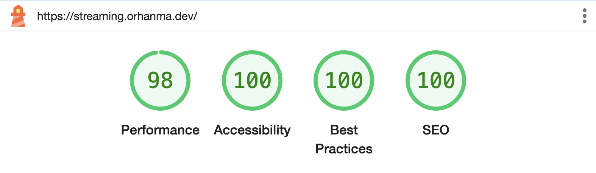
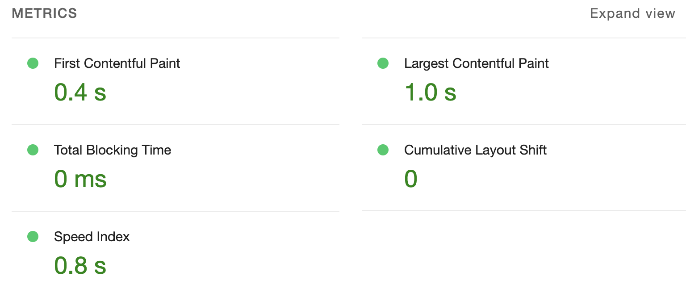

# Super Streaming

Ce projet consiste à créer un petit site permettant de rechercher des films présents dans le base de données de [The Movie Database (TMDB)](https://www.themoviedb.org/)

## Stack technique

### [Next.js](https://nextjs.org/)

Dans sa version 14.2.3, j'utilise les features de ce meta-framework pour optimiser mon application notamment:

- Les server actions
- Routes dynamiques
- Les composants built-in comme Image...
- Caching
  <br>
  ...

J'ai aussi utilisé [Typescript](https://www.typescriptlang.org/), pour un code avec moins de bugs dès le développement.

### Pour les interfaces utilisateurs

#### [Tailwind](https://tailwindcss.com/)

Permet de créer un style cohérent, responsive et rapidement grâce à ses classes utilitaires.

#### [Shadcn/ui](https://ui.shadcn.com/)

Une librairie de composant open-source construite avec [React](https://react.dev/) et [Tailwind](https://tailwindcss.com/) et basée sur [Radix/ui](https://www.radix-ui.com/) pour obtenir des composants non stylisée mais responsives et [accessibles](https://www.radix-ui.com/primitives/docs/overview/accessibility).

### Autres

#### [Cypress](https://www.cypress.io/)

J'ai utilisé [Cypress](https://www.cypress.io/) pour réaliser des test End-to-End et unitaires sur mes composants React. Cela m'a permis de surveiller l'évolution de mon code à l'ajout de nouvelles features.

#### [Docker](https://www.docker.com/)

J'ai utilisé [Docker](https://www.docker.com/) pour apprendre l'outil et permettre de lancer l'application Next.js dans un environnement isolé de l'ordinateur host.

### Pipeline [CI/CD](https://resources.github.com/devops/ci-cd/)

Avec Next.js et Docker, j'ai utilisé les [Github Actions](https://docs.github.com/fr/actions) et mon droplet (VPS) [Digital Ocean](https://www.digitalocean.com/) pour automatiser le déploiement du projet sur mon serveur privé.

Voici les étapes:

- [Création d'un serveur privé](https://www.digitalocean.com/community/tutorials/how-to-set-up-an-ubuntu-server-on-a-digitalocean-droplet) sous Ubuntu 24.04 LTS
- Configuration d'un reverse proxy avec [Nginx](https://nginx.org/en/)
- Liaison du serveur avec mon [nom de domaine OVH](https://www.ovhcloud.com/fr/domains/) depuis l'espace OVH dedié
- Création d'une image Docker avec le [fichier Dockerfile](https://docs.docker.com/reference/dockerfile/)
- Renseignement des [variables d'environnements](https://docs.github.com/fr/actions/security-guides/using-secrets-in-github-actions) (clés SSH, adresse IP, usernames, passwords...) et secrets dans la section secrets du repository
- Création d'un fichier [workflow Github](https://docs.github.com/en/actions/using-workflows/about-workflows) pour créer une image du projet, la récupérer et déployer le conteneur dans mon serveur lors du push sur la branch main du repository

#####

## Installation locale

Ouvrer votre terminal et utilisez les commandes suivantes

```bash
git clone git@github.com:OrhanMA/Super-streaming.git
cd Super-streaming
pnpm install
```

<br/>

Pour bien que l'application soit fonctionnelle vous aurez besoin d'une [clé API TMDB](https://developer.themoviedb.org/docs/getting-started).

<br/>

Créez un fichier .env.local avec votre clé API renseignée:

```bash
mv .env.example .env.local
TMDB_API_KEY=<your-api-key>
```

<br/>

Lancer votre serveur local:

```
npm run dev
```

Pour la version build (optimisée pour la production)

```
npm run build && npm run start
```

### [Docker](https://www.docker.com/)

Pour lancer l'application dans un conteneur Docker, lancer Docker puis voici les commandes pour créer une image à partir du fichier Dockerfile:

```
docker build -t super-streaming .

docker run -p 3000:3000 -e TMDB_API_KEY=<clé-api> super-streaming
```

La première commande [crée une image Docker à partir du fichier Dockerfile](https://docs.docker.com/reference/cli/docker/image/build/) en la nommant 'super-streaming'.

La seconde [crée et lance un conteneur](https://docs.docker.com/reference/cli/docker/container/run/) à partir de cette image en passant la valeur de la clé API pour la variable d'environnement `TMDB_API_KEY`.

`-e` permet de set une variable d'environnement
`-p` permet de lier le port 3000 du conteneur au port 3000 du host 127.0.0.1 pour nous en local

### Performance

En lancant un dizaine de tests [Lighthouse](https://developer.chrome.com/docs/lighthouse/overview?hl=fr), l'outile de Google Chrome pour évaluer la qualité ses sites web, j'obtiens les scores suivants de manière constante (test réalisé sur la site en production):



